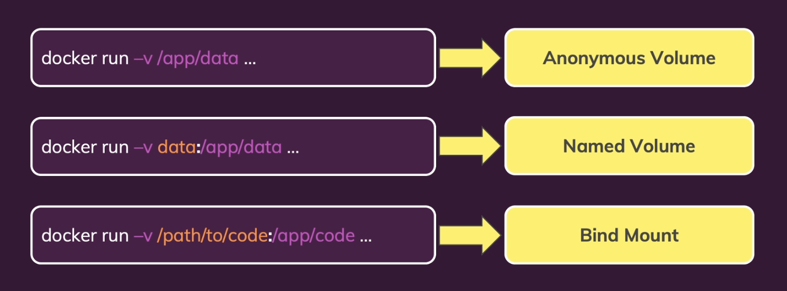

# Docker

### Useful Commands:

## Containers:

**Run container, providing an option to name the container**

- docker run --name \<custom-container-name> \<image-hash or image-name>

**Run container, providing an option to publish a port**

- docker run -p \<local-port>:\<exposed-port> \<image-hash or image-name>

**Run container, providing an interactive and persistent terminal session within that container**

- docker run -it \<image-hash or image-name>

**Run container, providing an option to remove the container after it exits**

- docker run --rm \<image-hash or image-name>

**Run container, creating and mounting an anonymous Docker-managed volume**

- docker run -v \<path-inside-container-filesystem> \<image-hash or image-name>

**Run container, creating (if needed) and mounting a Docker-managed named volume**

- docker run -v \<volume-name>:/\<path-inside-container-filesystem> \<image-hash or image-name>

**Run container, mounting a host directory as a bind mount**

- docker run -v \<folder-name-in-host-machine>:\<path-inside-container-filesystem> \<image-hash or image-name>

**Run container, providing an option to define environment variables**

- docker run --env \<environment-variable-key>=\<environemnt-variable-value> \<image-hash or image-name>
- docker run -e \<environment-variable-key>=\<environemnt-variable-value> \<image-hash or image-name>
- docker run -e \<environment-variable-key>=\<environemnt-variable-value> -e \<environment-variable-key>=\<environemnt-variable-value> \<image-hash or image-name>

**Run container, providing an option to define a path to an environment configuration file**

- docker run --env-file \<environment-configuration-file-path> \<image-hash or image-name>

**Start existing container**

- docker start \<container-name>

**Stop container**

- docker stop \<container-name>

**List running containers**

- docker ps

**List containers**

- docker ps -a

**Check container logs**

- docker logs \<image-hash or image-name>

**Copy files into a container**

- docker cp \<local-source-path> \<container-id or container-name>:/\<destination-path>

**Copy files from a container**

- docker cp \<container-id or container-name>:/\<source-path> \<local-destination-path>

**Remove stopped containers (boring and overworked way)**

- docker rm <...container-names>

## Images:

**Create image using Dockerfile and name:tag it**

- docker build -t \<image-name>:\<image-tag> .
  In the end of the execution of this command, it will generate an hash that can be used in order to be ran with the next command.

**Remove images (boring and overworked way)**

- docker rmi <...image-ids>

**Remove unused images**

- docker image prune -a

**List images**

- docker images

**Inspect images (detailed information like OS, environment variables, etc)**

- docker inspect \<image-hash or image-name>

## Volumes

**List volumes**

- docker volume ls

**Remove volume**

- docker volume rm \<volume-name>

**Remove unused volumes**

- docker volume prune

**Create anonymous, named and bind mount volumes**

**Inspect volumes (name, options, mountpoint)**

- docker inspect \<image-hash or image-name>
